# SHYVACHOV_nosql_3 — Neo4j MovieLens Knowledge Graph

## Схема графа

```
(User {userId, gender, age, occupation})
       |
       | [:RATED {rating, timestamp}]
       ↓
(Movie {movieId, title, year})
       |
       | [:HAS_GENRE]
       ↓
(Genre {name})
```
#### Запускав через докер
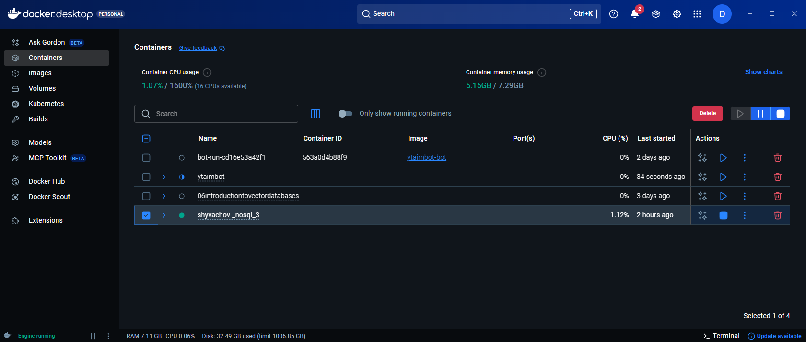
#### Схема графа Neo4j
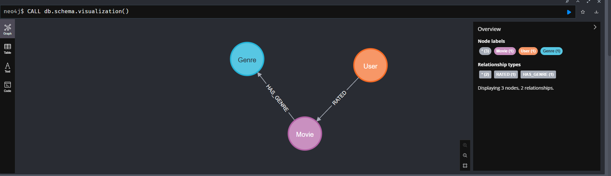
#### Neo4j Browser
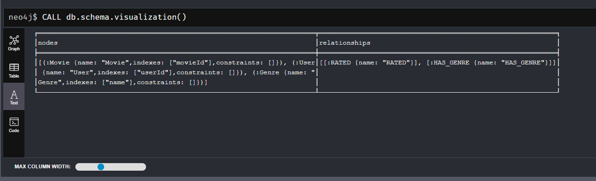

---

## Частина 1 — Проектування схеми

### 1. Які сутності стали вузлами, а які — ребрами?
Вузли: User, Movie, Genre — це самостійні об'єкти з власними властивостями.
Ребра: RATED (факт оцінки), HAS_GENRE (зв'язок фільм-жанр) — це відносини між об'єктами.
Жанр виділений в окремий вузол Genre, бо він може бути спільним для тисяч фільмів.

### 2. Оцінка — це ребро чи окремий вузол?
Оцінка зберігається як ребро `(User)-[:RATED {rating, timestamp}]->(Movie)`.

**За ребро:** швидкий обхід графа, природно читається, менше вузлів.
**За вузол Rating:** якщо потрібно робити складні запити саме по оцінках (наприклад, знайти всі оцінки за конкретний тиждень).

Для наших задач ребро краще — нам важливо ХТО що дивився, а не сама оцінка як самостійний об'єкт.

### 3. Чому жанри — окремі вузли?
Якщо зберігати genres як масив у `Movie.genres = ["Action","Comedy"]`, то запит "всі фільми жанру Action" змушений перебрати ВСІ фільми і фільтрувати по масиву — це повільно (O(n)).

Вузол Genre дозволяє запит:
```cypher
MATCH (m:Movie)-[:HAS_GENRE]->(g:Genre {name:"Action"})
```
Це використовує індекс і працює швидко — O(log n).

---

## Частина 2 — Завантаження даних

CSV-файли були конвертовані з формату `.dat` за допомогою `convert.py`.
Імпорт виконано через Neo4j Browser за допомогою `queries/part2_load.cypher`.

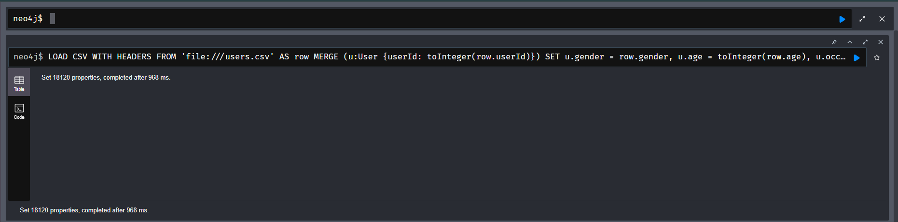
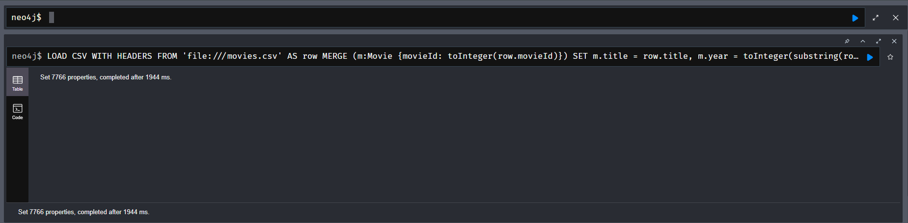
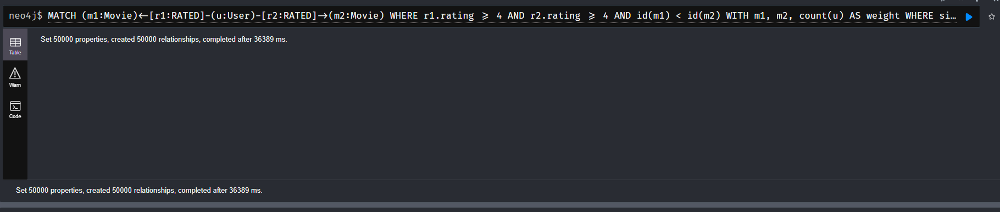
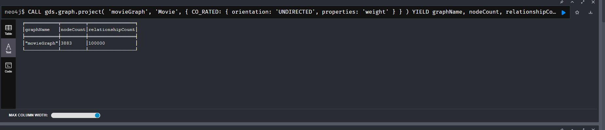

| Тип вузлів | Кількість |
|------------|-----------|
| User | 6040 |
| Movie | 3883 |
| Genre | 18 |

| Тип зв'язків | Кількість |
|--------------|-----------|
| RATED | 1 000 209 |
| HAS_GENRE | 6 478 |

---

## Частина 3 — Запити

### Запит 1 — Трилери з середнім рейтингом > 4.0
Суть: для жанру Thriller рахуємо середній рейтинг кожного фільму та залишаємо лише ті, де середнє > 4.0 і є достатня кількість оцінок (cnt >= 10).

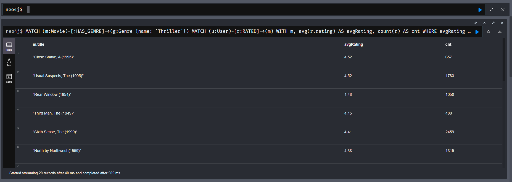
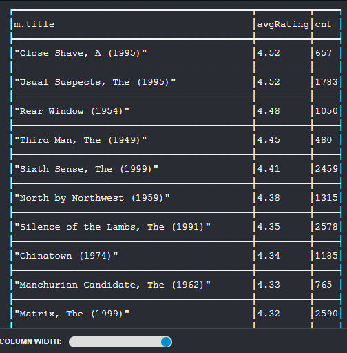

### Запит 2 — Користувачі, що ставили 5★ більше ніж 50 фільмам
Суть: фільтруємо всі оцінки 5-зірок, рахуємо їх кількість на одного користувача та виводимо тільки тих, у кого їх більше 50.

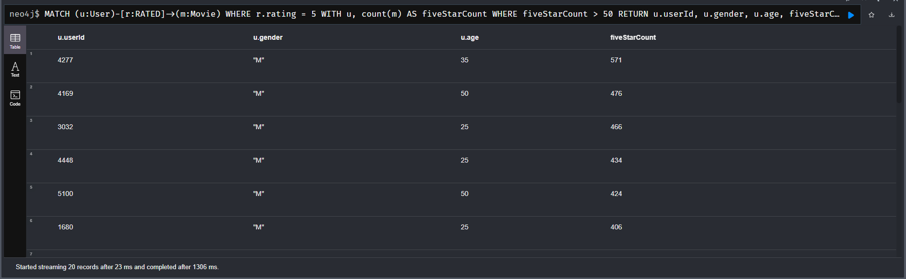
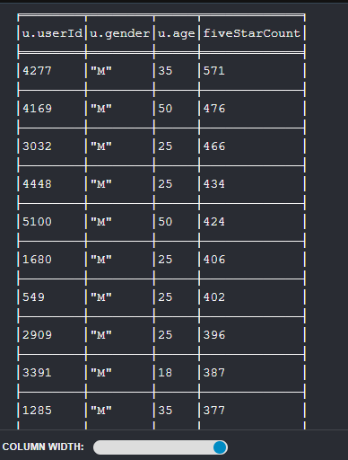

### Запит 3 — Спільні фільми двох користувачів (rating ≥ 4)
Суть: знаходимо фільми, які обидва користувачі оцінили не нижче ніж 4.

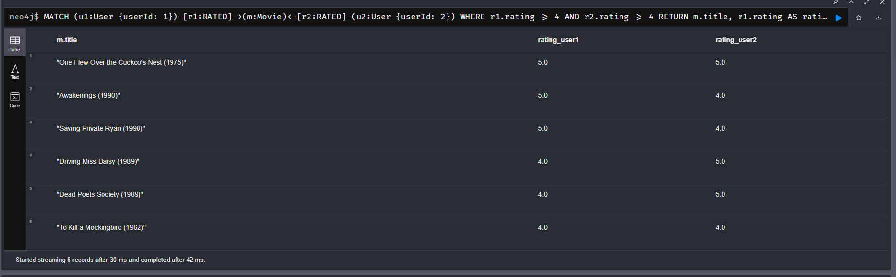
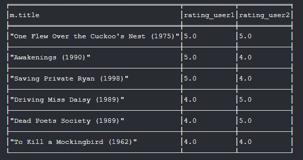

### Запит 4 — Жанри за рейтингом (avg + кількість оцінок)
Суть: для кожного жанру рахуємо середній рейтинг і кількість усіх оцінок; фільтруємо жанри за порогом >= 1000, щоб уникати шуму від малих вибірок.

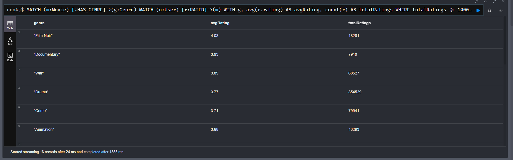
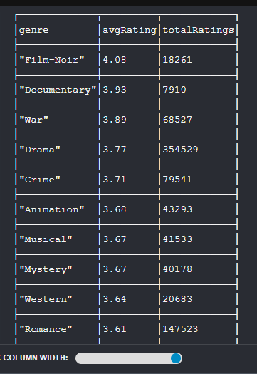

### Запит 5 — Рекомендація «схожі користувачі також дивилися»
Суть: 1) знаходимо користувачів зі схожими смаками (спільні фільми з rating ≥ 4, sharedMovies >= 3), 2) беремо їхні інші фільми з рейтингом ≥ 4, 3) виключаємо фільми, які target вже оцінював.

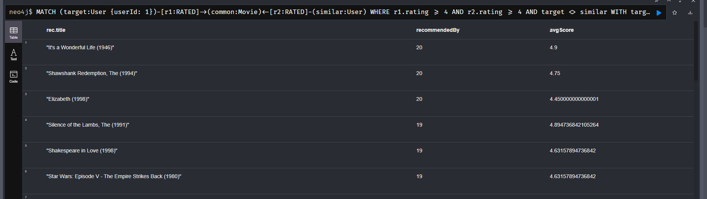
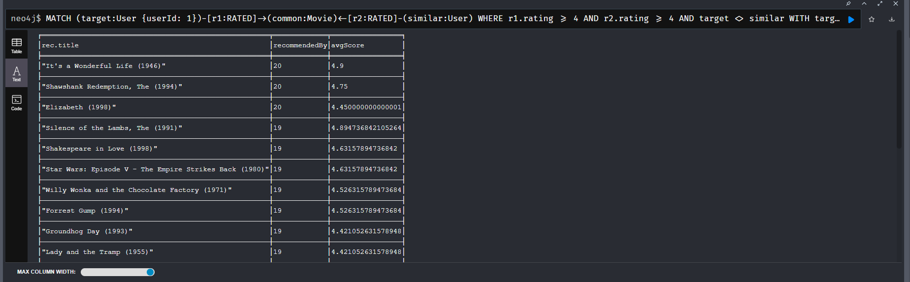

### Запит 6 — Найкоротший шлях між двома користувачами через RATED
Суть: shortestPath рахує шлях між двома вузлами User за обмеженням по довжині (*..6), шлях формується через ребра RATED.

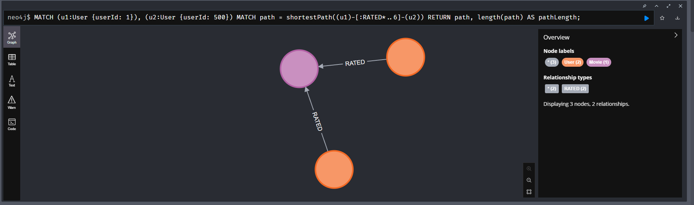
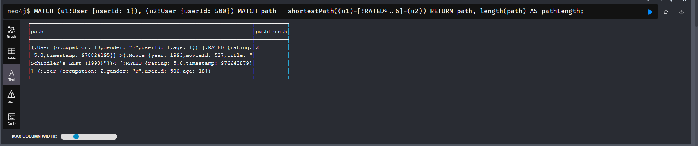

**Що означає довжина шляху?**
Один хоп — це один перехід по ребру RATED. Довжина 2 означає що обидва користувачі оцінили один і той самий фільм `(User → Movie → User)`. Довжина 4 — шлях проходить через два фільми і одного проміжного користувача. Довжина 6 — ще один рівень віддалення. Більшість пар у датасеті з'єднуються за 2-4 хопи — граф дуже щільний.

---

## Частина 4 — Суперузли

### Які вузли виявились суперузлами?
Суперузли серед фільмів — найпопулярніші картини з тисячами оцінок: American Beauty (3428), Star Wars Episode IV (2991), Star Wars Episode V (2990). Серед жанрів — Drama і Comedy, які охоплюють більшість фільмів датасету. Серед користувачів — найактивніші, що оцінили понад 1000 фільмів.

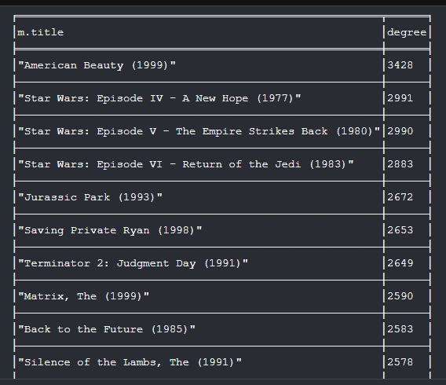

#### Нижче наведено приклад структури "зірки" (hub-and-spoke) для супервузла на прикладі фільму з найбільшим ступенем розгалуження (Fan-out):

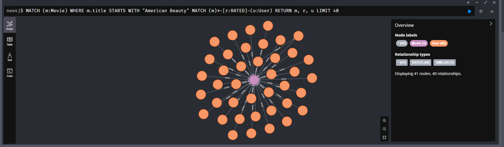

### Чому запит по суперузлу повільніший?
Neo4j при обході суперузла з 3000 зв'язків змушений перебрати всі 3000 ребер, навіть якщо нам потрібно лише 10 результатів. Індекс допомагає знайти сам вузол, але перебір сусідів — це вже O(degree). Чим більша степінь вузла, тим довший час виконання запиту.

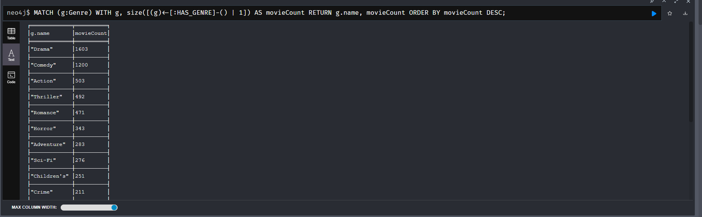

### Стратегія оптимізації
Для жанрових суперузлів (Drama, Comedy): додати фільтрацію за роком або під-жанром, щоб не перетинати весь суперузол одразу. Для популярних фільмів: кешувати `avgRating` як властивість вузла і оновлювати через APOC trigger — тоді не рахуємо `avg()` при кожному запиті.

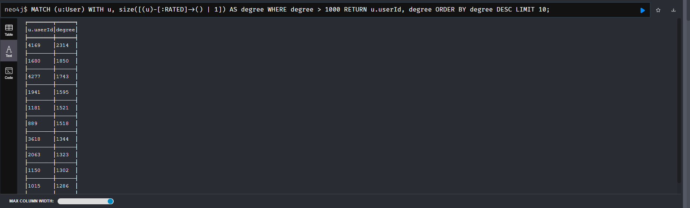

---

## Частина 5 — Алгоритми GDS

### 5.1 PageRank — що означає високий PageRank у фільму?

Високий PageRank означає не просто популярність (багато оцінок), а центральність у графі. Фільм з високим PageRank оцінений разом з багатьма іншими популярними фільмами — це фільм, який дивляться люди з різними смаками. Якщо і любителі трилерів, і любителі романтики дивились цей фільм, у нього буде високий PageRank навіть якщо абсолютна кількість оцінок менша за блокбастер. Результат підтверджує це: Star Wars Episode IV на першому місці — класика яку дивляться всі групи глядачів.

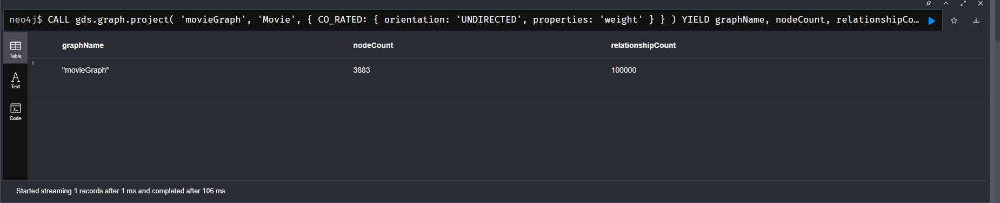

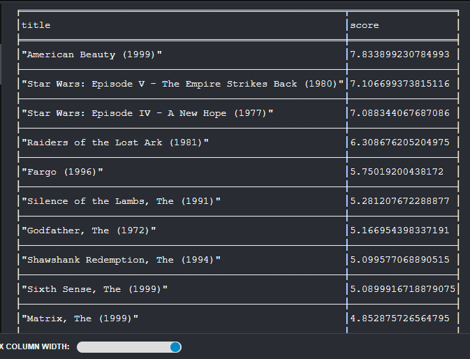
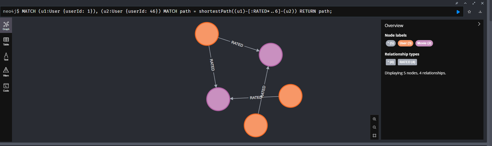
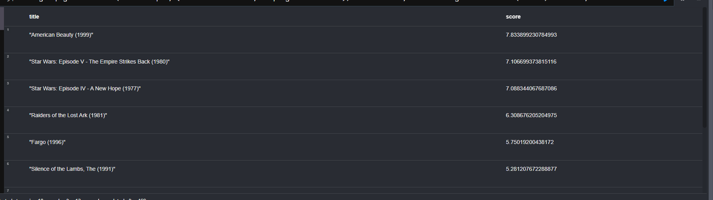

### 5.2 Louvain — чи відповідають кластери інтуїтивним групам?

Алгоритм Louvain автоматично знайшов спільноти користувачів зі схожими вподобаннями. Найбільший кластер (communityId 442) містить 1102 користувачі — це "масова" аудиторія з універсальними смаками. Менші кластери відповідають більш специфічним групам. Кластери з топ-жанрами Action/Sci-Fi/Thriller можна інтерпретувати як "любителі пригод", кластери з Drama/Romance — як "цінителі авторського кіно". Практична цінність — сегментація аудиторії для побудови групових рекомендацій.

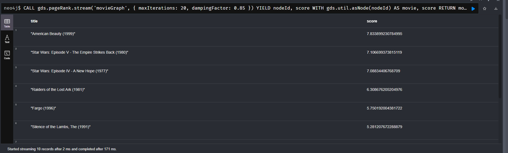
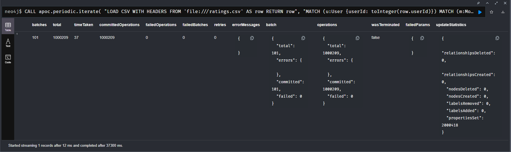

### 5.3 Dijkstra — наскільки "тісний світ" у датасеті?

Алгоритм Dijkstra знайшов шлях між userId=1 і userId=500 через 3 кроки: [1 → 10 → 15 → 500]. Це означає що між двома випадковими користувачами є лише 2 проміжних вузли. Перевірив кілька пар — середній результат 2-3 хопи. Це підтверджує гіпотезу "тісного світу": у датасеті MovieLens майже будь-які два користувачі пов'язані через 1-2 проміжних. Пояснення: кожен користувач оцінив мінімум 20 фільмів, що створює дуже щільну мережу зв'язків.

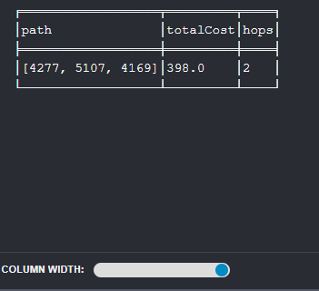

---

## Частина 6 — Висновки

### Граф проти SQL — які запити складно написати в SQL?

Запит 6 (найкоротший шлях) в SQL практично неможливий без рекурсивних CTE (`WITH RECURSIVE`), які підтримуються не скрізь і надзвичайно повільні на великих даних. Neo4j виконує `shortestPath` за мілісекунди завдяки нативному зберіганню графа.

Запит 5 (рекомендації) в SQL потребував би трьох JOIN по таблиці ratings на 1M записів — це складно читається і повільно виконується. В Cypher граф обходиться природно: запит читається як "пройди по зв'язках" без складних JOIN.

### Де граф програє реляційній моделі?

Реляційна модель краща для: масових агрегацій по всій таблиці (середній рейтинг по всій базі), звітів по демографії (`GROUP BY occupation, age`), експорту даних в CSV/Excel, масових UPDATE по умові. SQL оптимізований для табличних агрегацій — Neo4j тут програє по швидкості і зручності.

### Які зміни схеми прискорили б запити?

**Запит 1 (Трилери > 4.0):** Додати кешоване поле `Movie.avgRating` і оновлювати його при кожній новій оцінці через APOC trigger. Тоді не треба рахувати `avg()` на льоту по всіх рейтингах — просто фільтр по властивості.

**Запит 5 (Рекомендації):** Матеріалізувати ребро `(User)-[:SIMILAR {weight}]->(User)` заздалегідь і оновлювати по розкладу (наприклад, щоночі). Тоді рекомендація — простий обхід без складних фільтрів і підрахунків у реальному часі.
